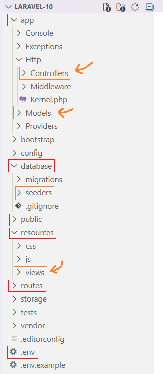

# Тема 1 - Введение в Laravel

Laravel - это целая экосистема. Но нам достаточно писать простенькие сайты (в рамках дем. экзамена), поэтому мы пройдёмся лишь по самой базе.

Всего тем будет шесть. Практические части, которые будут прилагаться к ним, взаимосвязаны и нацелены на то, чтобы с помощью Laravel прорешать вариант дем. экзамена.

## Установка проекта

Laravel-проект - это набор готовых PHP-файлов и папок.

1. Скачайте его отсюда: [публичный архив с Яндекс Диска](https://disk.yandex.ru/d/Fp4nYmuNlBv18A).
2. Перекиньте содержимое архива в корень сервера (папку ``localhost``).
3. В настройках «Open Server» смените версию PHP на ``8.1``. Версию Apache тоже смените.

На этом моменте сайт уже должен быть доступен.

> Важный момент! В предоставленном архиве есть файл ``.htaccess``: он нужен для перенаправления запросов, без которого Laravel будет просто лежать на сервере отдельными файлами. В оригинальном же пресете от разработчиков его нет. Если перед дем. экзаменом ``.htaccess`` уберут, вам нужно предварительно заучить его.

## Файловая структура

Не будем останавливаться на разжёвывании каждой папки. Рассмотрим только те, в которых будет происходить основная работа.



Обратите внимание на те папки, на которые указывают оранжевые стрелки. Это - те места, где Laravel разграничивает зону ответственности по паттерну MVC (model-view-controller):

- **Модели** (models): специальные классы, которые представляют таблицы из БД; их фишка в том, что вы можете создавать, просматривать, изменять и удалять записи из таблиц, не используя SQL-запросы.
- **Контроллеры** (controllers): это приём HTTP-запросов (например, POST-запрос на регистрацию) и выдача ответов (например, сообщение об успехе или ошибке).
- **Образы** (views): HTML-шаблоны.

### Назначения папок (обведены красным)

1. **app** - ядро всего приложения.
2. **database** - создание таблиц БД (подпапка ``migrations``) и их наполнение (подпапка ``seeders``) без phpMyAdmin.
3. **public** - публичные файлы, к которым есть доступ по прямой ссылке (например, ``http://localhost/favicon.ico``).
4. **resources** - отображение страниц. В подпапке ``views`` и хранятся шаблоны.
5. **routes** - маршрутизация: т.е. мы обращаемся к серверу через URL (например, ``http://localhost/users/1``), а сервер, разбивая строку обращения, передаёт GET/POST запросы или обычной функции, или контроллеру.
6. **.env** - файл окружения; в нём будем писать только название БД, пароль к ней и пользователя.

## Как создавать новые файлы

Т.к. в Laravel почти всё - это PHP-классы, мы создаём новые классы с расчётом, что в них УЖЕ должны быть какие-то подключения (через ``use``), конструкторы, методы и прочее.

**Используйте специальную утилиту - ``php artisan``.**

Файл ``artisan`` есть в корне проекта. Мы обращаемся к нему, как к обычному PHP-скрипту через консоль:
```bash
php artisan make:controller ExampleController
```

Если команды PHP нет в консоли, пишите полный путь до интерпретатора PHP. Для «Open Server» это выглядит примерно так:
```bash
C:\OSPanel\modules\PHP\PHP_8.1\php.exe artisan make:controller ExampleController
```

Команды artisan мы ещё разберём отдельно.

## Практическая часть

Просто следуйте инструкциям: 

1. Проверьте, что сайт работает. 
2. Создайте через artisan любой контроллер (просто чтобы появился файл в ``app/Http/Controllers``).

Также, измените данные для соединения с БД. Для этого измените ``.env`` в следующих строчках:
```
DB_CONNECTION=mysql
DB_HOST=localhost
DB_PORT=3306
DB_DATABASE= # ваша БД
DB_USERNAME= # ваш пользователь
DB_PASSWORD= # ваш пароль
```

Само соединение происходит автоматически. 

Проверьте, что соединение есть. Для этого просто отдавайте его через фасад DB при обращении к главной странице сайта.
```php
<?php

// routes/web.php

use Illuminate\Support\Facades\Route;
use Illuminate\Support\Facades\DB;

Route::get('/', function() {
    dd(DB::connection()->getPdo());
});
```

И перейдите на сам сайт.
