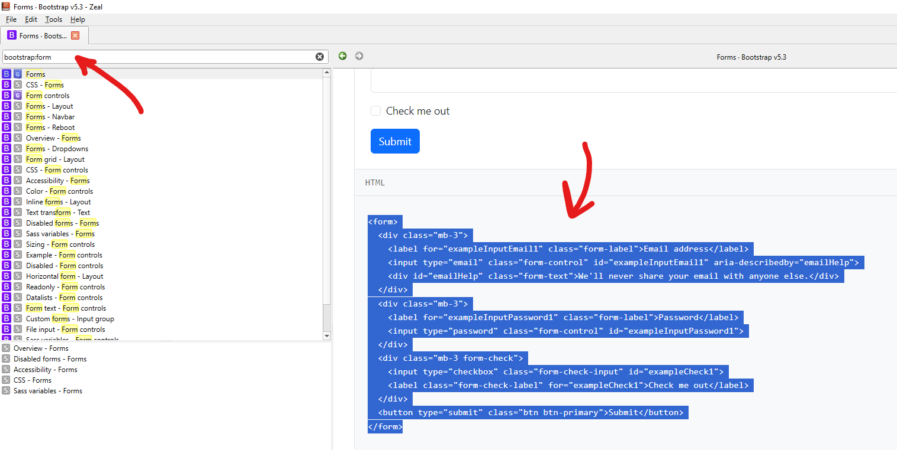

# Тема 6 - CRUD-операции

Эта тема - завершающая. На ней сайт по заданию из ``TASK.md`` будет полностью выполнен.

**CRUD-операции** - это набор операций, которые можно совершать над сущностями: CREATE - создание, READ - чтение, UPDATE - обновление, DELETE - удаление.

## Практическая часть

1. Создайте resource-контроллеры для сущностей ``Course`` и ``Application``.
2. Написать полный функционал для этих сущностей - CRUD.
3. При написании компонентов используйте Bootstrap (по **Zeal**).

## Resource-контроллер

До этого мы создавали пустые контроллеры, где сами писали методы (в основном, ``index``). Но в Laravel предусмотрены **пресеты** для контроллеров, и один из них - ``--resource``.

```php
php artisan make:controller CourseController --resource
```

Это - такой контроллер, внутри которого уже есть методы:
- ``index()``: возвращает компонент с полным списком сущностей.
- ``create()``: возвращает форму для создания сущности.
- ``store(Request $request)``: принимает POST-данные и сохраняет новую сущность.
- ``show(string $id)``: возвращает компонент ЕДИНИЧНОЙ сущности.
- ``edit(string $id)``: возвращает форму для редактирования сущности.
- ``update(Request $request, string $id)``: принимает PUT/PATCH-данные и изменяет сущность.
- ``destroy(string $id)``: принимает DELETE-запрос и удаляет сущность.

### Route::resource()

Для resource-контроллера не нужно писать каждый отдельный маршрут.

```php
// routes/web.php

Route::resource('courses', CourseController::class);
```

Эта запись разворачивается в следующий набор маршрутов:
```
+-----------+-------------------------+------------------+---------+
| Метод     | URI                     | Имя роута        | Метод   |
+-----------+-------------------------+------------------+---------+
| GET|HEAD  | /                       |                  | Closure |
| GET|HEAD  | courses                 | courses.index    | index   |
| POST      | courses                 | courses.store    | store   |
| GET|HEAD  | courses/create          | courses.create   | create  |
| GET|HEAD  | courses/{course}        | courses.show     | show    |
| PUT|PATCH | courses/{course}        | courses.update   | update  |
| DELETE    | courses/{course}        | courses.destroy  | destroy |
| GET|HEAD  | courses/{course}/edit   | courses.edit     | edit    |
+-----------+-------------------------+------------------+---------+
```

### Порядок роутов

Обратите внимание на этот порядок роутов:
1. ``courses/create``.
2. ``courses/{course}``.

Create-роут должен находиться выше. Если поменять их местами, create-роут никогда не будет достигнут, т.к. маршрутизатор будет перехватывать ``courses/{course}``. 
1. ``courses/{course}``; технически, URI ``courses/create`` подходит под этот паттерн, т.к. часть **course** может быть **любой строкой**.
2. ``courses/create``.

> Если ваше приложение будет возвращать не ту страницу (по заданному вами URI) или ошибку 404, **меняйте роуты местами**.

### Замена $id на модель

Поскольку не важно, как мы называем динамические параметры из роута (которые оборачиваем в ``{}``), в контроллере можно менять не только их название, но и тип данных.

Например, мы меняем метод ``show()``:
```php
// app/Http/Controllers/CourseController.php

class CourseController extends Controller {
    //
    
    public function show(string $id)
    {
        //
    }
}
```

На этот вариант:
```php
// app/Http/Controllers/CourseController.php

use App\Models\Course;

class CourseController extends Controller {
    //
    
    public function show(Course $course)
    {
        return view('courses.show', [
            'course' => $course
        ]);
    }
}
```

И теперь, **$course** - это полноценная модель.

Если в методе контроллера для принимающего аргумента из роута вы указываете тип модели, то значение аргумента берётся как **ID** и вставляется в метод ``::findOrFail($id)``. Таким образом возвращается либо модель с соответвующим ID, либо выбрасывается 404.

## Реализация CRUD

Напомню, что метод ``validate()`` возвращает только те поля, которые проходят валидацию, и только в виде ассоциативного массива: ``[НАЗВАНИЕ_ПОЛЯ => ЗНАЧЕНИЕ_ПОЛЯ]``.

CRUD-методы - ``create`` и ``update`` - как раз тоже принимают в качестве аргумента такие же ассоциативные массивы.

### Создание

```php
// app/Http/Controllers/CourseController.php

public function store(Request $request)
{
    $data = $request->validate([
        'title' => ['required'],
        'wanted_start_date' => ['required'],
        'payment_method' => ['required'],
    ]);

    $course = Course::create($data);

    return redirect()
        ->route('courses.index')
        ->with('message', 'Course created!');
}
```

### Редактирование

```php
// app/Http/Controllers/CourseController.php

public function update(Request $request, Course $course)
{
    $data = $request->validate([
        'title' => ['required'],
        'wanted_start_date' => ['required'],
        'payment_method' => ['required'],
    ]);

    $course->update($data); // отличие только в одной строке

    return redirect()
        ->route('courses.index')
        ->with('message', 'Course updated!');
}
```

Но следует учесть, что этот метод принимает только PUT/PATCH-методы.

Значит, в форме, из которой данные будут отправляться, нужно переопределять метод.

```html
<!-- resources/views/courses/edit.blade.php -->

@props(['course'])

@extends('layout')
@section('content')

<form
    action="{{ route('courses.update', $course->id) }}"
    method="POST"
>
    @csrf
    @method('put')

    <!-- Остальная форма -->
</form>

@endsection
```

### Удаление

```php
// app/Http/Controllers/CourseController.php

public function destroy(Course $course)
{
    $course->delete();

    return redirect()
        ->route('courses.index')
        ->with('message', 'Course deleted!');
}
```

И кнопка для удаления в компоненте списка сущностей.

```html 
<!-- resources/views/courses/index.blade.php -->

@props(['courses'])

@extends('layout')
@section('content')

@if ($courses->isNotEmpty())
    @foreach ($courses as $course)
        <p>{{ $course->id }} | {{ $course->title }}</p>

        <form
            action="{{ route('courses.destroy', $course->id) }}"
            method="POST"
        >
            @csrf
            @method('delete')

            <button type="submit">Delete</button>
        </form>
    @endforeach
@else
    <p>Empty list</p>
@endif

@endsection
```

## Bootstrap и Zeal

В рамках дем. экзамена будет дана электронная документация - **Zeal**.

Её главное преимущество - в ней даются целые куски разметки на **Bootstrap**. То есть даже необязательно знать эту CSS-библиотеку, чтобы делать красивый и адаптивный дизайн.

Просто сохраните Bootstrap-файлы (CSS, JS) в ``/public``, а затем - подключите эти файлы в главном шаблоне через функцию ``asset()``: в аргументе указывайте путь к файлу относительно ``/public``.

```html
<!-- resources/views/layout.blade.php -->

<!DOCTYPE html>
<html lang="en">
<head>
    <meta charset="UTF-8">
    <meta name="viewport" content="width=device-width, initial-scale=1.0">
    <title>Laravel App</title>

    <link rel="stylesheet" href="{{ asset('css/bootstrap.css') }}">
</head>
<body>
    <header>
        @include('navbar')
    </header>

    <main>
        @yield('content')
    </main>

    <script src="{{ asset('js/bootstrap.bundle.js') }}"></script>
</body>
</html>
```

И, например, найдя компонент формы и скопировав его из Zeal-документации.



Просто вставляйте его заместо уже существующей формы и убирайте лишнее.

```html
<!-- resources/views/login.blade.php -->

@extends('layout')
@section('content')

@if ($errors->any())
    @php
        dump($errors->toArray());
    @endphp
@endif

<form
    action="{{ route('login') }}"
    method="POST"
>
    @csrf
    <div class="mb-3">
        <label class="form-label">Login</label>
        <input type="text" class="form-control">
    </div>

    <div class="mb-3">
        <label class="form-label">Password</label>
        <input type="password" class="form-control">
    </div>

    <button type="submit" class="btn btn-primary">Отправить</button>
</form>

@endsection
```

## Что следует почитать о Bootstrap

Темы даны в тех же названиях, что и в документации.

### Базовые темы

- ``Spacing``: как применять ``margin`` и ``padding`` через утилитарные классы ``mt-1``, ``m-4`` и другие.
- ``Flex`` и ``Columns``: как размещать компоненты (в том числе адаптивно).

### Наиболее полезные компоненты

- ``Cards`` - карточки.
- ``Navbar`` - навигационная панель.
- ``Tables`` - таблицы.
- ``Alerts``, ``Toasts`` - сообщения об ошибках.
- ``Forms`` - формы.
- ``Modal`` - модальные окна. 

> По модальным окнам: учтите, что требуется подключить и JS-скрипт для Boostrap, а также задавать для каждого модального окна **уникальный** ID (иначе при добавлении нескольких модальных окон - включая кнопки для их открытия - вы будете открывать только одну).
