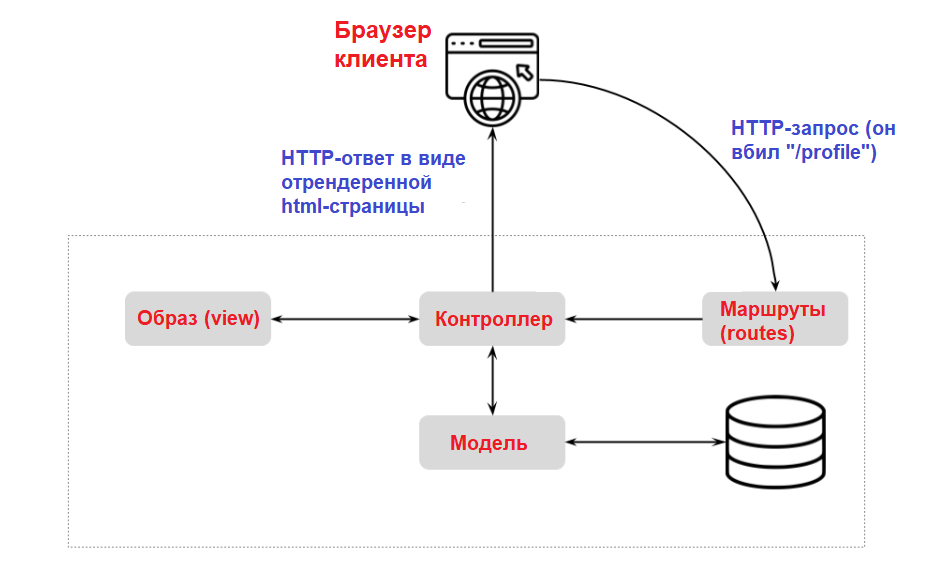
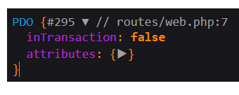

# Тема 1 - Введение в Laravel

Laravel - это целая экосистема. Но нам достаточно писать простенькие сайты (в рамках дем. экзамена), поэтому мы пройдёмся лишь по самой базе.

Всего тем будет шесть. Практические части, которые будут прилагаться к ним, взаимосвязаны и нацелены на то, чтобы с помощью Laravel прорешать вариант дем. экзамена.

## Установка проекта

Laravel-проект - это набор готовых PHP-файлов и папок.

1. Скачайте его отсюда: [публичный архив с Яндекс Диска](https://disk.yandex.ru/d/Fp4nYmuNlBv18A).
2. Перекиньте содержимое архива в корень сервера (папку ``localhost``).
3. В настройках «Open Server» смените версию PHP на ``8.1``. Версию Apache тоже смените.

На этом моменте сайт уже должен быть доступен.

> Важный момент! В предоставленном архиве есть файл ``.htaccess``: он нужен для перенаправления запросов, без которого Laravel будет просто лежать на сервере отдельными файлами. В оригинальном же пресете от разработчиков его нет. Если перед дем. экзаменом ``.htaccess`` уберут, вам нужно предварительно заучить его.

## Файловая структура

Не будем останавливаться на разжёвывании каждой папки. Рассмотрим только те, в которых будет происходить основная работа.


Обратите внимание на те папки, на которые указывают оранжевые стрелки. Это - те места, где Laravel разграничивает зону ответственности по паттерну MVC (model-view-controller):

- **Модели** (models): специальные классы, которые представляют таблицы из БД; их фишка в том, что вы можете создавать, просматривать, изменять и удалять записи из таблиц, не используя SQL-запросы.
- **Контроллеры** (controllers): это приём HTTP-запросов (например, POST-запрос на регистрацию) и выдача ответов (например, сообщение об успехе или ошибке).
- **Образы** (views): Blade-шаблоны.

> Blade - шаблонизатор с особым синтаксисом. Он завязан на двойных фигурных скобках (внутри которых вычисляемое значение: php-переменные), @-директивах (условный рендеринг, циклы) и выглядит так:
```php
// resources/views/users/index.blade.php

@props(['users']) // В этот шаблон передаётся массив юзеров

@if ($users->isNotEmpty())

<table>
    <thead>
        <th>ID</th>
        <th>Имя</th>
        <th>Фамилия</th>
        <th>Возраст</th>
    </thead>

    <tbody>
        @foreach ($users as $user) // Обычный перебор юзеров
            <tr>
                <td>{{ $user->id }}</td>
                <td>{{ $user->first_name }}</td>
                <td>{{ $user->last_name }}</td>
                <td>{{ $user->age }}</td>
            </tr>
        @endforeach
    </tbody>
</table>

@else

<p>Нет пользователей</p>

@endif
```

### Назначения папок (обведены красным)

1. **app** - ядро всего приложения: модели, контроллеры.
2. **database** - создание таблиц БД (подпапка ``migrations``) и их наполнение (подпапка ``seeders``) без phpMyAdmin.
3. **public** - публичные файлы, к которым есть доступ по прямой ссылке (например, ``http://localhost/favicon.ico``).
4. **resources** - отображение страниц. В подпапке ``views`` и хранятся шаблоны.
5. **routes** - маршрутизация запросов; о ней - следующий пункт.
6. **.env** - файл окружения; в нём будем писать только название БД, пароль к ней и пользователя.

## Маршрутизация запросов

Если вы пишете сайт на чистом PHP, то обращаетесь буквально к скриптовым файлам: ``http://localhost/products.php?id=1``.

В условиях Laravel это невозможно по двум причинам:
1. Сложная архитектура.
2. Обращение к файлам напрямую небезопасно.

В Laravel мы обращаемся по таким URL: ``http://localhost/users/1``. Сервер, разбивая строку обращения, передаёт наш запрос контроллеру.

> Мы работаем ТОЛЬКО с web-запросами (т.е. они возвращают html-странички) и, соответственно, с файлом ``routes/web.php``.

Подробнее о машрутах будет рассказано в теме по контроллерам.

## Жизненный цикл запроса

Это - классическая схема MVC-приложения, но адаптированная под Laravel (добавлен узел с маршрутами).



Запрос пользователя проходит в таком порядке:
1. URL отлавливается маршрутизатором (файлом ``routes/web.php``).
2. Маршрут передаётся контроллеру.
3. Контроллер, если ему было что-то передано, сперва обращается к модели.
4. Модель возвращает данные из БД для контроллера.
5. Контроллер собирает данные для ответа и обращается к шаблону (view).
6. Шаблон, получив данные для ответа, пихает их в html-теги и возвращает обычную html-страницу.
7. Контроллер возвращает пользователю html-страницу.

## Как создавать новые файлы

Т.к. в Laravel почти всё - это PHP-классы, и мы должны создавать новые классы с расчётом, что в них УЖЕ будут какие-то подключения (через ``use``), конструкторы, методы и прочее.

**Используйте специальную утилиту - ``php artisan``.**

Файл ``artisan`` есть в корне проекта. Мы обращаемся к нему, как к обычному PHP-скрипту через консоль:
```bash
php artisan make:controller ExampleController
```

Если команды PHP нет в консоли, пишите полный путь до интерпретатора PHP. Для «Open Server» это выглядит примерно так:
```bash
C:\OSPanel\modules\PHP\PHP_8.1\php.exe artisan make:controller ExampleController
```

Команды artisan мы ещё разберём отдельно.

## Соединение с БД

Измените файл ``.env`` в следующих строчках - добавьте данные для соединения с БД:
```
DB_CONNECTION=mysql
DB_HOST=localhost
DB_PORT=3306
DB_DATABASE= # ваша БД
DB_USERNAME= # ваш пользователь
DB_PASSWORD= # ваш пароль
```

Само соединение будет происходить автоматически.

## Практическая часть

Просто следуйте инструкциям: 

1. Проверьте, что сайт работает. 
2. Проверьте, что вы можете пользоваться утилитой artisan. Создайте через него контроллер **DBCheckController**.
3. В контроллер добавьте метод, который будет вызываться маршрутизатором.

```php
<?php

// app/Http/Controllers/DBCheckController.php

namespace App\Http\Controllers;

use Illuminate\Http\Request;
use Illuminate\Support\Facades\DB; // подключите этот фасад вручную

class DBCheckController extends Controller
{
    public function index(Request $request)
    {
        dd(DB::connection()->getPdo());
    }
}
```

> Функции ``dd()`` и ``dump()`` - это отладка от Laravel. Оба являются более удобным аналогом стандартному ``var_dump()``. Разница между ними лишь в том, что ``dd()`` - это **die and dump**: значит, она выведет то, что мы пишем в аргумент, и закончит работу.

4. Привяжите маршрут главной страницы к методу **index** контроллера **DBCheckController** (это передаётся как массив, где первый аргумент - класс контроллера, второй - метод внутри него).
```php
<?php

// routes/web.php

use Illuminate\Support\Facades\Route;

use App\Http\Controllers\DBCheckController; // сами подключите контроллер

Route::get('/', [DBCheckController::class, 'index']);
```

5. Перейдите на сайт. Там должен отображаться это.

